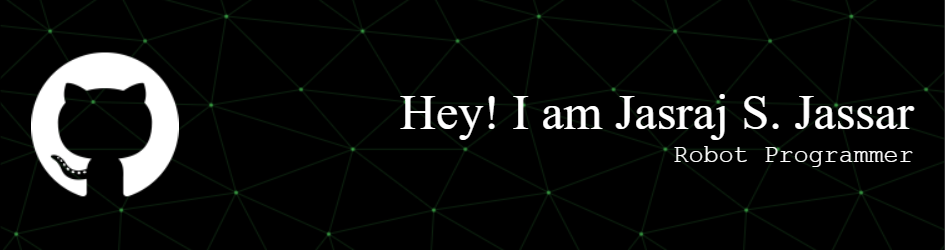

Welcome to my page! 

⚙️ I use daily: Python, C/C++, Kotlin, ROS, PLCs, TwinCAT, EtherCAT, Linux, Git

🌍 I'm mostly active within the robotics & automation community

🤖 Built: AGV (PLCNext), Automation Systems, Resturant Robots custom apps, TwinCAT+HMI systems

💬 ping me about robotics, PLCs, ROS, automation, reverse engineering, AI systems

</img>
